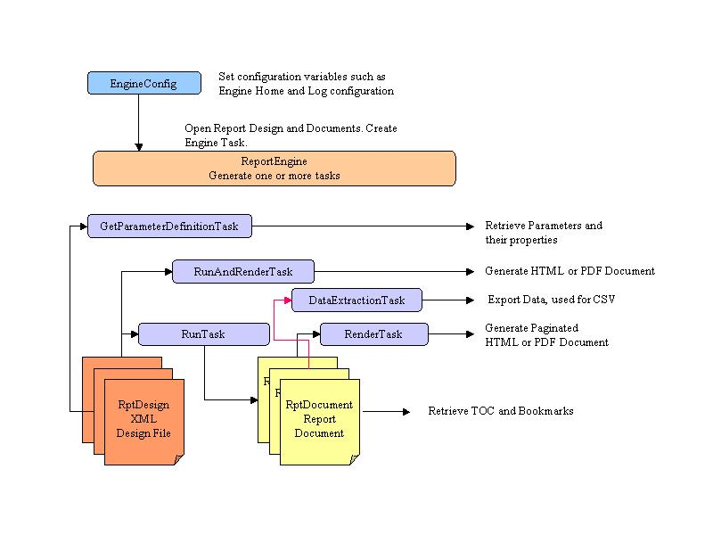

### Background

The BIRT Report Engine API (RE API) allows you to integrate the run-time part of BIRT into your application. This may mean integrating into a stand alone Java application, deploying as part of a servlet or embedding it within an RCP application. The engine supports the following operations:

*    Discover the set of parameters defined for a report.

*    Get the default values for parameters.

*    Run a report to produce HTML/Paginated HTML, WORD, XLS, PS, ODT, ODS, ODP or PDF output.

*    Fetch an image or chart for a report.

*    Export Report data to CSV

*    Retrieve TOCs, Bookmarks, etc

The report engine supports extensions for custom report items, data access, and custom output formats. Extensions are discussed elsewhere. This section will focus on how your application integrates with the report engine.

### Installing the Engine

The first step is to download, install, and configure the BIRT engine. The engine is more than just a simple JAR file; it also includes a set of extensions (plug-ins), and a set of data drivers.

*    First download the Report Engine from the [BIRT download site](http://download.eclipse.org/birt/downloads).

*    This file will be named birt-runtime-version.zip.

*    Unzip this file into a directory, such as _c:\birtruntime_.

*    When you set the Engine Home, which is explained later, use _C:/birtruntime/birt-runtime-version/ReportEngine_ as the value.

*    Add the jars in the _ReportEngine/lib_ directory to your _classpath/buildpath_.

**Note** that if you are using the RE API within an RCP/Eclipse application these steps are not needed. Just add the RE API plugins to your application and call the needed functions.

The BIRT Viewer sample is also bundled with the Report Engine download. It is located under the WebViewerExample directory. If you decide to use this example, see [Viewer Setup](viewer-setup.md) for an explanation. The Viewer uses the RE API to generate reports within the context of a servlet. It provides additional features, such as printing, TOCs, Page controls, etc. Before using the RE API, verify that the Viewer is not applicable to your application.

### Engine Source

If you prefer to work directly with the BIRT source code, the Engine API is in the _org.eclipse.birt.report.engine_ project within [our Git repository](https://github.com/eclipse-birt/birt/tree/master/engine/org.eclipse.birt.report.engine). The source is also available from the BIRT site in one package (the BIRT Source Code Package), which can be downloaded from the [BIRT download site](http://download.eclipse.org/birt/downloads).

### Javadoc

This page provides an overview of the engine. To do actual development, consult the Engine Javadoc. These docs are available within BIRT Help.

### Configuring JDBC Drivers

You must configure the engine to include any JDBC drivers that you need.

#### Birt POJO Runtime Note:
Add the driver jar to your classpath.
To do this, copy the driver jar file to the R_eportEngineInstall/birt-runtime-version/ReportEngine/plugins/org.eclipse.birt.report.data.oda.jdbc_version/drivers_ Directory.

### API Overview

The following are the key steps to use the API, identifying the classes and interfaces you use for each step.

*    Create an instance of EngineConfig to set options for the report engine.

*    Set the Engine Home and start the Platform (Loads the plug-ins). If you are using the RE API in plugin format there is no need to set BIRT Home. If you are using the RE API from within a servlet, be sure to read about PlatformServletContext later on this page.

*    Create an instance of the ReportEngine class. You can use this object to perform multiple tasks.

*    Open a report design using one of the openReport( ) methods of ReportEngine.

*    Obtain information about report parameters using IGetParameterDefinitionTask. This is only needed if you want to build a custom parameter page or collect parameter definition information. The IRunTask and the IRunAndRenderTask interfaces have methods for setting parameter values.

*    Run and render a report using IRunAndRenderReportTask or IRunTask and IRenderTask.

*    Repeat steps 4-6 for the next report.

*    When done, call shutdown( ) on your engine instance. If using the engine in a servlet shudown the engine when the servlet shuts down.

The following sections describe the primary Engine classes in detail. The Engine API includes a number of secondary helper classes referenced within each description. The diagram below, serves as an overview of the classes needed to accomplish a given task.

### EngineConfig

Use the EngineConfig class to set global options for the report engine as a whole. Use it to specify the location of engine plug-ins, the location of data drivers, and to add application-wide scriptable objects.

					EngineConfig config = new EngineConfig( );
					config.setEngineHome( "put engine path here" );
					

The engine home should be set to installedlocation/birt-runtime-version/ReportEngine when deployed as a stand alone Java Application. See the wiki examples for Servlet and RCP deployment.

Other functions of interest within this class are:

*   setLogConfig(String directoryName, Level level)
    This call sets the Log directory name and level (OFF, SEVERE, WARNING, INFO, CONFIG, FINE, FINER, FINEST and ALL)
    Setting directoryName to null will log to stdout.

### ReportEngine

The ReportEngine class represents the BIRT Report Engine. There is a significant cost associated with creating an engine instance, due primarily to the cost of loading extensions. Therefore, each application should create just one ReportEngine instance and use it to run multiple reports. This is important to remember when deploying the engine in a servlet as well.

The report engine is created through a factory supplied by the Platform. Before creating the engine, you should start the Platform, which will load the appropriate plug-ins. This is done by calling Platform.startup(config) that takes an EngineConfig object as argument. After using the engine, call Plaform.shutdown() function to do clean up work, which includes unloading the extensions. When shutting down the engine in some environments, it may also be required to call:
RegistryProviderFactory.releaseDefault();

This should be added after the Platform.shutdown() method is called. You will need to import the org.eclipse.core.internal.registry.RegistryProviderFactory package. See [Bugzilla 351052](https://bugs.eclipse.org/bugs/show_bug.cgi?id=351052) for more details.

	try{
	final config = new EngineConfig( );
		//delete the following line if using BIRT 3.7 (or later) POJO runtime
		//As of 3.7.2, BIRT now provides an OSGi and a POJO Runtime.
	
		config.setEngineHome( "C:\\birt-runtime-2_6_2\\birt-runtime-2_6_2\\ReportEngine" );
		config.setLogConfig(c:/temp, Level.FINE);
	
		Platform.startup( config );
		//If using RE API in Eclipse/RCP application this is not needed.
		IReportEngineFactory factory = (IReportEngineFactory) Platform
				.createFactoryObject( IReportEngineFactory.EXTENSION_REPORT_ENGINE_FACTORY );
		IReportEngine engine = factory.createReportEngine( config );
		engine.changeLogLevel( Level.WARNING );
	}catch( Exception ex){
		ex.printStackTrace();
	}
	// Run reports, etc.
	...
	
	// destroy the engine.
	try
	{
		engine.destroy();
		Platform.shutdown();
		//Bugzilla 351052
		RegistryProviderFactory.releaseDefault();
	}catch ( EngineException e1 ){
	    // Ignore
	}

Other functions of interest within this class are:

_engine.changeLogLevel(java.util.logging.Level.FINE);_

Change engine log level (OFF, SEVERE, WARNING, INFO, CONFIG, FINE, FINER, FINEST and ALL)

### IReportRunnable

BIRT report designs are stored as XML files. By default the extension is rptdesign.
To work with the report design in the engine, you must first load the report using one of the openDesign( ) methods in the ReportEngine class.

The report design open methods returns a IReportRunnable instance that represents the engine's view of the report design.

		IReportRunnable report = engine.openReportDesign( name );
					

Note that BIRT supplies many options for opening reports such as the filename or an input stream. Use the returned object to obtain parameter data or run the report.
The class provides methods for getting report properties such as the title, author and so on. It also provides methods for getting images embedded (stored) within the report design. If your application requires more information about the design, you can obtain a Design Engine report handle, then use the [BIRT Design Engine API](deapi.md) to traverse the report design.

### IReportDocument

BIRT optionally can store reports in an intermediate format, after generation and before rendering. This document, with the default extension rptdocument, can be manipulated with the IReportDocument interface. The Engine will create this document when the runTask is used. The BIRT viewer uses this format to do pagination, TOCs, CSV extraction, bookmarks, etc. When finished with a IReportDocument, be sure to close it, with the close() method.

The Engine's openDocument method returns a IReportDocument that represents the intermediate report document.

The example below illustrates getting the TOC from the report document, after the runTask is used to generate the report.

	IReportDocument ird = engine.openReportDocument("c:/work/test/TOCTest.rptdocument");
	//get root node
	TOCNode td = ird.findTOC(null);
	List children = td.getChildren( );
	//Loop through Top Level Children
	if ( children != null && children.size( ) > 0 ){
		for ( int i = 0; i < children.size( ); i++ ){
			TOCNode child = ( TOCNode ) children.get( i );
			System.out.println( "Node ID " + child.getNodeID());
			System.out.println( "Node Display String " + child.getDisplayString());
			System.out.println( "Node Bookmark " + child.getBookmark());
		}
	}
					

### IEngineTask

BIRT reports support scripting. Operations that execute scripts require a scripting context. Report operations also require a locale. BIRT Engine tasks provide the framework for managing the scripting context, report locales and so on. In general, if an operation requires neither a script context nor a locale, it will appear as a method on the engine or the report design. However, if the operation does require these items, then a task class represents the operation.

For example, opening a design file or retrieving an image in the design file does not require setting up a scripting context. Other operations, such as retrieving default parameters, retrieving a dynamic selection list, and running and rendering a report, all support scripting, require a scripting context, and are represented as tasks.

Create tasks using the factory methods on the ReportEngine class. The supported Tasks are shown below:

*    engine.createDataExtractionTask();

*    engine.createGetParameterDefinitionTask();

*    engine.createRenderTask();

*    engine.createRunTask();

*    engine.createRunAndRenderTask();

### IDataExtractionTask

Use this task to extract data from a report document. The BIRT viewer uses this class to extract report data into CSV format. This class supports extracting data from the report document by specifying the result set and columns you would like to have extracted.
From the Viewer code

	dataTask.selectResultSet( resultSetName );
	dataTask.selectColumns( columnNames );
	dataTask.setLocale( locale );
					

Below is an example that uses the Data Extraction Task to extract the first two columns of data.

	//Open previously created report document
	IReportDocument iReportDocument = engine
	     .openReportDocument("c:/work/test/TOCTest.rptdocument");
	
	//Create Data Extraction Task		
	IDataExtractionTask iDataExtract = engine.createDataExtractionTask(iReportDocument);
			
	//Get list of result sets		
	ArrayList resultSetList = (ArrayList)iDataExtract.getResultSetList( );
					
	//Choose first result set
	IResultSetItem resultItem = (IResultSetItem)resultSetList.get( 0 );
	String dispName = resultItem.getResultSetName( );
	iDataExtract.selectResultSet( dispName );
					
	IExtractionResults iExtractResults = iDataExtract.extract();
	IDataIterator iData = null;
	try{
		if ( iExtractResults != null ){
			iData = iExtractResults.nextResultIterator( );
			//iterate through the results
			if ( iData != null  ){
				while ( iData.next( ) ){	
					Object objColumn1;
				    Object objColumn2;
					try{
						objColumn1 = iData.getValue(0);
					}catch(DataException e){
						objColumn1 = new String("");
					}
					try{
						objColumn2 = iData.getValue(1);
					}catch(DataException e){
						objColumn2 = new String("");
					}
					System.out.println( objColumn1 + " , " + objColumn2 );
				}
				iData.close();
			}
		}
	}catch( Exception e){
			e.printStackTrace();
	}
	
	iDataExtract.close();
					

### IGetParameterDefinitionTask

Use this task to obtain information about parameters. Parameter default values are expressions, and so a scripting context (represented by the task) is required. Parameter definitions provide access to the parameter definition information that the report designer entered at design time. If a parameter has custom XML or user-defined properties defined, then these are also available. Parameters can be organized into groups. Your application has the choice of retrieving the parameters organized by group (as they should be displayed to the user), or in ungrouped form (useful for creating a programmatic interface.)

The _IParameterGroupDefn_ and _IScalarParameterDefn_ interfaces provide information about parameter groups and individual parameters.

The following example opens a report design and iterates through the parameters and parameter groups. If a List Box parameter is found, which is not in a group, the selection values are retrieved.

	// Open a report design
	IReportRunnable design = engine.openReportDesign("C:/work/test/parameters.rptdesign");

	IGetParameterDefinitionTask task = engine.createGetParameterDefinitionTask(design);
	Collection params = task.getParameterDefns(true);

	Iterator iter = params.iterator( );
	// Iterate over all parameters
	while(iter.hasNext())
	{
		IParameterDefnBase param = (IParameterDefnBase) iter.next();
		// Group section found
		if (param instanceof IParameterGroupDefn) {
			// Get Group Name
			IParameterGroupDefn group = (IParameterGroupDefn) param;
			System.out.println("Parameter Group: " + group.getName());
			// Get the parameters within a group
			Iterator i2 = group.getContents().iterator();
			while (i2.hasNext()) {
				IScalarParameterDefn scalar = (IScalarParameterDefn) i2.next();
				System.out.println("\t" + scalar.getName());
			}
		} else {
			// Parameters are not in a group
			IScalarParameterDefn scalar = (IScalarParameterDefn) param;
			System.out.println(param.getName());
			// Parameter is a List Box
			if (scalar.getControlType() == IScalarParameterDefn.LIST_BOX) {
				Collection selectionList = task.getSelectionList(param.getName());
				// Selection contains data
				if (selectionList != null) {
					for (Iterator sliter = selectionList.iterator(); sliter.hasNext();) {
						// Print out the selection choices
						IParameterSelectionChoice selectionItem = (IParameterSelectionChoice) sliter.next();
						String value = (String) selectionItem.getValue();
						String label = selectionItem.getLabel();
						System.out.println(label + "--" + value);
					}
				}
			}
		}
	}

	task.close();
					

Use the _IGetParameterDefinitionTask_ class to evaluate the default value for a parameter. The parameter default value is an expression, and the task provides the required execution context.

	IScalarParameterDefn param = ...;
	IGetParameterDefinitionTask task = ...;
	Object value = task.getDefaultValue(param);
    

### IRenderTask

Use this task to render a report document to a specific output (eg, HTML, PDF, ...). This task expects the document to exist, which means it has been generated with the RunTask engine task. This class renders the report, based on the supplied page range, page number or all if no page is specified.

The following example renders the first two pages of the "Pages" report document. You will notice that it renders the two pages as one page of HTML.

	//Open a report document 
	IReportDocument iReportDocument = engine.openReportDocument("c:/work/test/Pages.rptdocument");
	//Create Render Task
	IRenderTask task = engine.createRenderTask(iReportDocument);
	//Set parent classloader report engine
	task.getAppContext().put(EngineConstants.APPCONTEXT_CLASSLOADER_KEY, 
	     RenderTaskExample.class.getClassLoader()); 
	IRenderOption options = new RenderOption();		
	options.setOutputFormat("html");
	options.setOutputFileName("output/resample/eventorder.html");
	if( options.getOutputFormat().equalsIgnoreCase("html")){
		HTMLRenderOption htmlOptions = new HTMLRenderOption( options);
		htmlOptions.setImageDirectory("output/image");
		htmlOptions.setHtmlPagination(false);
		//set this if you want your image source url to be altered
		//If using the setBaseImageURL, make sure
		//to set image handler to HTMLServerImageHandler
		htmlOptions.setBaseImageURL("http://myhost/prependme?image=");
		htmlOptions.setHtmlRtLFlag(false);
		htmlOptions.setEmbeddable(false);
	}else if( options.getOutputFormat().equalsIgnoreCase("pdf") ){
		PDFRenderOption pdfOptions = new PDFRenderOption( options );
		pdfOptions.setOption( IPDFRenderOption.FIT_TO_PAGE, new Boolean(true) );
		pdfOptions.setOption( IPDFRenderOption.PAGEBREAK_PAGINATION_ONLY, new Boolean(true) );
	}
	//Use this method if you want to provide your own action handler
	options.setActionHandler(new MyActionHandler());
	//file based images
	//options.setImageHandler(new HTMLCompleteImageHandler())
	//Web based images.  Allows setBaseImageURL to prepend to img src tag
	options.setImageHandler(new HTMLServerImageHandler());
	IRenderTask task = engine.createRenderTask(document); 		
	task.setRenderOption(options);
	task.setPageRange("1-2");
	task.render();
	iReportDocument.close();
					

### IRunTask

Use this task to run a report and generate a report document, which is saved to disk. The report document can then be used with the _IRenderTask_ to support features such as paging.

The following example simply creates a report document and saves it to disk.

	//Open a report design 
	IReportRunnable design = engine.openReportDesign("C:/work/test/MyOrders.rptdesign");
	 
	//Create task to run the report - use the task to execute the report and save to disk.
	IRunTask task = engine.createRunTask(design); 
	
	//Set parent classloader for engine
	task.getAppContext().put(EngineConstants.APPCONTEXT_CLASSLOADER_KEY, 
	     RunTaskExample.class.getClassLoader()); 
	     
	//run the report and destroy the engine
	task.run("c:/work/test/MyOrders.rptdocument");		
	task.close();
					

### IRunAndRenderTask

Use this task to run a report and output it to one of the supported output formats. This task does not create a report document. Create a new task for each report that you run.

Reports may take parameters. The _IRunAndRenderReportTask_ takes parameter values as a HashMap or you can set them individually. The _IRunAndRenderReportTask_ provides the _validateParameters(...)_ method to validate the parameter values before you run the report.

	//Open the report design
	ReportRunnable design = engine.openReportDesign("Reports/TopNPercent.rptdesign"); 
	
	//Create task to run and render the report,
	IRunAndRenderTask task = engine.createRunAndRenderTask(design);
	
	//Set parent classloader for engine
	task.getAppContext().put(EngineConstants.APPCONTEXT_CLASSLOADER_KEY, 
	     RunAndRenderTaskExample.class.getClassLoader()); 
	
	//Set parameter values and validate
	task.setParameterValue("Top Percentage", (new Integer(3)));
	task.setParameterValue("Top Count", (new Integer(5)));
	task.validateParameters();
	
	//Setup rendering to HTML
	HTMLRenderOption options = new HTMLRenderOption();		
	options.setOutputFileName("output/resample/TopNPercent.html");
	options.setOutputFormat("html");
	
	//Setting this to true removes html and body tags
	options.setEmbeddable(false);
	task.setRenderOption(options);
	//run and render report
	task.run();
	task.close();
					

### Miscellaneous

Described below are some miscellaneous items that bear mentioning when using the BIRT Report Engine API

#### Adding Script Objects

BIRT's script engine supports adding Java objects at the API level. If you wish the Java object to be available to the Report, retrieve the application context at the EngineConfig or Task level and add the object to the Map. For example, adding a Java object to the task.

Add the following code to your task.

    MyJavaObject jo = new MyJavaObject();
	task.getAppContext().put("MyJavaScriptItem", jo);
					

Now within the the script editor, you can reference your Java Object as follows:

	testMyJavaObject = MyJavaScriptItem.getMyMethod();
					

#### Rendering to an Output Stream

When rendering a report it may be desirable to output the report to an output stream, such as _HttpServletResponse_. To do this modify your RenderOption instance to use _setOutputStream_ instead of _setOutputFileName_. For example,

	public void webReport( HttpServletResponse response ){
	.
	.
	.
	//Set rendering options 
	HTMLRenderOption options = new HTMLRenderOption();
	options.setOutputStream(response);
	task.setRenderOption(options);		
	//run the report
	task.run();
	}
					

#### IPlatformContext - Web Based Plugin Loading

#### Birt POJO Runtime Note:
This section can be ignored if your are installing BIRT 3.7 or later. Just add the BIRT plugins to the Web Application classpath.

By default BIRT loads plug-ins located in the BIRT_HOME/plugins directory. The plug-ins loaded provide functionality for connecting to data sources, emitters (eg, PDF, WORD, XLS, HTML ...), and chart rendering. BIRT_HOME in the examples on this page is set using the setEngineHome method of the EngineConfig class. BIRT loads these plug-ins using the Java File API.

This method is usually sufficient. If deployed to a web application, the developer can usually call ServletContext.getRealPath to retrieve the real path and set the BIRT_HOME accordingly. This can present a problem when deploying to a war file. Certain application servers will return null when getRealPath is called. This will result in the plug-ins not getting loaded.

The IPlatformContext interface describes the methods needed to load the resources required by the BIRT runtime. Within BIRT there are two implementations of this interface, PlatformFileContext() and PlatformServletContext(). The Platform Context is set using the setEngineContext method of the EngineConfig class. If this method is not called it defaults to PlaformFileContext() and uses the Java File API to load the resources. The PlatformServletContext class uses Resource based operations. So if you are deploying an application to the Web that uses the BIRT API and it is not contained in a war you can use the default and set your engine home to something similar to:

	config.setEngineHome( servletContext.getRealPath("/WEB-INF"));
					

The BIRT Viewer application will load the plug-ins from /WEB-INF/Plugins directory. If you deploy your application in a war, setup your code like:

	//this causes the plug-in loader to look in the current directory.
	config.setEngineHome("");
				
	//Using the PlatformServletContext will cause the OSGi loader to look for the
	//plug-ins in the WEB-INF/Platform directory.  If this directory
	//does not exist create it. 
	//Next copy the plug-ins directory from the ReportEngine directory to
	//the WEB-INF/Platform/ directory.
	IPlatformContext context = new PlatformServletContext( sc );
	config.setPlatformContext( context );
					

#### Embedding Report Output

If you need to embed your report output into an existing web page you can use the _options.setEmbeddable(true);_ method. This will remove the \<HTML\> and \<BODY\> tags in the generated report. For example,

	public void embedReport( HttpServletResponse response ){
	.
	.
	.
	//Set rendering options 
	HTMLRenderOption options = new HTMLRenderOption();
	options.setOutputStream(response);
	options.setEmbeddable(true);
	task.setRenderOption(options);		
					
	//run the report
	task.run();
	}
					

### Emitter Configuration

An "emitter" is the component of the report engine that produces output. BIRT provides many emitters such as HTML, XLS and PDF. To configure emitter options you need to use the RenderOption class. In some of the examples above this was done, with code similar to the following:

	IRenderOption options = new RenderOption();		
	options.setOutputFormat("html");
	options.setOutputFileName("output/resample/eventorder.html");
					

BIRT also provides an extended RenderOption class for the PDF and HTML emitters (PDFRenderOption and HTMLRenderOption). The PDFRenderOption class provides methods for handling fonts and the HTMLRenderOption class provides methods for handling images, url encoding, and other html specific settings. You may need to configure the HTML emitter to manage images.
BIRT supports several image types:

*    Images referenced using a URL

*    Embedded images

*    Images created to represent charts

*    Images from BLOB types

Your application must have a policy for handling images in HTML. URL-based images are usually no problem. However, you'll need to handle the others. The _IHTMLImageHandler_ interface defines the policy. The BIRT Engine provides two default implementations:

*    _HTMLCompleteImageHandler_: used to write images to disk when rendering a report to produce an HTML file on disk.

*    _HTMLServerImageHandler_: used to handle images for an engine running in an app server. This class is used by the BIRT example web viewer.

When you instantiate a _EngineConfig_ class the _HTMLCompleteImageHandler_ class is used by default. Images will be created in your temporary files location (ie C:\Documents and Settings\User\Local Settings\Temp). If this is not desired you can use the HTMLRenderOption class to change this location.

	HTMLRenderOption htmlOptions = new HTMLRenderOption( options);
	htmlOptions.setImageDirectory("output/image");
					

Setting the Image Directory instructs the RE API to store images, used within the report output, in that directory. If your emitter is setup with the standard _HTMLCompleteImageHandler_, the output image src attribute will point to this directory using the File protocol. If your emitter is configured with the _HTMLServerImageHandler_, you can specify an image base URL using the _HTMLRenderOption_ class. The engine will prepend all images with this URL in the src attribute of the report output.

	HTMLRenderOption options = new HTMLRenderOption();		
	options.setOutputFileName("output/resample/TopNPercent.html");
	options.setOutputFormat("html");
	options.setImageDirectory("C:\\apps\\apache-tomcat-5.5.20\\webapps\\2.2\\images");
	options.setBaseImageURL("http://localhost:8080/2.2/images/");		
	options.setImageHandler(new HTMLServerImageHandler());
	task.setRenderOption(options);
					

You can also create your own implementation of _IHTMLImageHandler_ if the above don't meet your needs.

If your code is going to be run in a servlet, please review the [ReportEngineService.java](https://github.com/eclipse-birt/birt/tree/master/viewer/org.eclipse.birt.report.viewer/birt/WEB-INF/classes/org/eclipse/birt/report/service) code in Git. The BIRT Viewer uses this class to configure the engine. The constructor for the _ReportEngineService_ uses the _HTMLServerImageHandler_ class, which in turn reads Image locations from the web.xml file.
