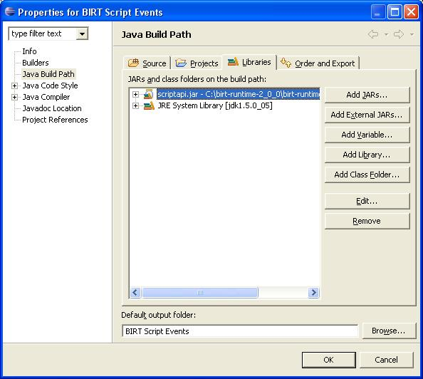

### Background

BIRT provides a rich scripting model based on the Mozilla Rhino engine. The processes that the Report engine uses to create reports can be classified in two phases, Report Generation and Presentation. The Generation phase consumes the report design and creates an intermediate file, called the report document. The Presentation phase uses the report document to render to HTML or PDF. The report creation pipeline can execute these phases as one task or in two tasks. If executed in one phase the report document is created in memory. This is the default behavior of the designer when "Preview as HTML" is chosen. If executed in two phases the report document is created and stored to disk. This is the default behavior of the designer when "Preview in Web Viewer" is selected.

Events within each phase can be overridden, by creating event handlers, to alter report content. BIRT allows these event handlers to be written in either JavaScript or Java. If you code your event handler in both Java and JavaScript the JavaScript version will be executed by default.

### Events

Script events are defined for three objects, Report Object, Report Elements, and Data Source(Sets). The phase the engine is processing determines what events and which properties of the object are available for customization. The diagram below illustrates what Script Events are available in a particular phase, for a given object.

Pictured below is a representation of the event firing order for a simple report containing a table and a data element. The event order is shown for separate generation and presentation phases.

### Generation phase.

### Presentation phase.

### reportContext and _this_

Selecting the Palette view while in the Script editor will display functions and variables that are available in the given event for the selected report element. For example the screenshot below is for the **onCreate** event handler of a data element.

Using the _this_ operator list available methods and properties for the element in the given event and is used to view or alter styles, values etc. See examples illustrated later.

Use of reportContext allows accessing or modifying of report wide properties. Using reportContext a developer can set global variables to share between elements. For example:

					onInitialize of the report
					reportContext.setPersistentGlobalVariable("testglobal", "test global string");
					

use of the Persistent version allows the variable to be persisted across generation and presentation. Also note that the variable is an Object type allowing greater flexibility.

					onPrepare of a label element in a table
					this.text = reportContext.getPersistentGlobalVariable('testglobal');
					

This global variable can be assigned to a data element using the binding editor. Simply reference the variable in the expression builder for the desired column. For example, if a column exist in the binding editor that retrieves a string from a data base, you could append your global variable to the value by entering the following expression:

					dataSetRow["MyString"] + "-" + reportContext
					     .getPersistentGlobalVariable('testglobal');
					

The reportContext also allows access to session variables.

					//attributeBean is a Birt Viewer supplied session variable
					myAttributeBean = reportContext.getHttpServletRequest()
					     .getAttribute('attributeBean');
					reportDoc = myAttributeBean.getReportDocumentName( );
					this.text = reportDoc;
					

The reportContext allows reading and modifying the context for use within scripts. For example:

					onInitialize of the report
					appContext = reportContext.getAppContext();
					importPackage(Packages.java.util)
					myArrList = new ArrayList();
					myArrList.add("one");
					myArrList.add("two");
					appContext.put("AppContextTest", myArrList);
					

This loads the current application context and modifies it for later use. Within a label element's onPrepare event handler, it could then be used as follows:

					appContext = reportContext.getAppContext();
					myObject = appContext.get("AppContextTest");
					this.text = myObject.size();
					

The above example could have also been implemented using:

					reportContext.setPersistentGlobalVariable("testglobal", myArrList);
					

The reportContext can also be used to retrieve the current locale and messages stored within a resource file.

### Report Level Events

* afterFactory - The afterFactory event executes upon terminating the generation phase.

* afterRender - The afterRender event executes at the end of the presentation phase.

* beforeFactory - The beforeFactory event executes prior to beginning the generation phase.

* beforeRender - The beforeRender event executes just prior to beginning the presentation phase.

* initialize - A script that executes before the report begins to execute in both the generation or presentation phase.

Within the initialize event you can define global functions, variables and objects. For example to create a global JavaScript function:

					function gTest(v){
					      return "Global Function:" + v;
					}
					//this line is only required if using the function within Chart Scripts
					reportContext.setPersistentGlobalVariable("gTest", gTest);
					

To use this function just call

					gTest("MyTest");
					or
					gTest = reportContext.getPersistentGlobalVariable("gTest");
					val = gTest("Use Persistent");
					

To access the reportContext object within a chart script use the following:

					context.getExternalContext().getScriptable()
					

To illustrate, the chart title could be altered with the following chart script:

					function beforeGeneration( chart, context ){
						importPackage(Packages.org.eclipse.birt.chart.model.type.impl);
						newChartTitle = context.getExternalContext().getScriptable()
						    .getPersistentGlobalVariable("testglobal");
						chart.getTitle().getLabel().getCaption().setValue(newChartTitle);
					}
					

In the beforeFactory event there are several methods that allow accessing elements within the report. The elements usually require a name. For example, using a Data Set named "orders", I want to display the query that was executed in a dynamic text element named "TestHeader". This can be achieved by entering the following script in beforeFactory

					query = this.getDataSet("orders").queryText
					this.getDynamicText("TestHeader").valueExpr = "query;";
					

### Report Element Events

*    onPrepare: This event gets called in the report generation phase. It is called once for each report element in the design. This is an opportunity to change the element design. The changes will affect all instances of the element, i.e. all table rows.

*    onCreate: Also a generation phase event. Here, the instance of the element can be modified and accessed. For example, an instance of a table row might be changed (setting every 10th rows background to red for example).

*    onRender: Presentation phase event. Similar to onCreate in that the instance is modifiable. Access to data is not available.

Here is a very simple scripting example for a detail row in a table:

					onPrepare:
					this.getStyle().backgroundColor = "red";//This would change all row instances
		
					onCreate:
					if (this.getRowData().getExpressionValue(3) > 100)
					this.getStyle().backgroundColor="red";//This will only change the row instance
					
					For a table with 100 rows, onPrepare will be called once (to change the 
					design), and onCreate and onRender will be called 100 times (to change the 
					instance).
					

### Report Element Event Examples

#### Setting Label, Text, Dynamic Text and Data Element values

Setting the value of a label element can be achieved by writting an event handler for the onPrepare or onCreate event and entering similar code presented below:

					this.text = "My New Label"
					

Obviously this is a simple example and the value could be set simply by double clicking on the text element. Using the JavaScript editor allows complex logic to be implemented.
Setting the value of a text element can be done in the onPrepare event by entering the following code in your event handler:

					this.content= = "My New Text"
					

When setting the value of a dynamic text element you will need to specify a value expression. This value expression gets evaluated when generating the report. Creating an event handler for the onPrepare event allows changing the value expression.

					this.valueExpr = "row['CITY']";
					

It is important to note that valueExpr expects a string. This is similar to what you would enter in the Expression Builder, but wrapped in quotes. So if you want to enter a string or partial string use single quotes.

					this.valueExpr = this.valueExpr = "'my row count: ' + (row[0] + 1)";
					

Setting values for data elements is accomplished by using the binding editor. If you wish to change this value in script you can set the value in the binding editor to a JavaScript variable. This variable can then be changed within script. If you use this method remember that order of execution is important. Changing the variable after the element is created will not change the data element value.

#### Setting TOC Entries in Script

The TOC expression is similar to value expressions in that it expects a string.

					this.tocExpression=this.tocExpression = "'tocbyrownumber: ' + row[0]";
					

#### Using row data within scripts

Row data is available in the onCreate event. This allows you to examine the values that will be used on the current row of a table or list.

					this.getRowData().getExpressionValue(int) 
					

should give you the value of the expression in the i:th column in your table.

					this.getRowData().getExpressionValue("some_expression") 
					

should give you the value of the provided expression for the row. This expression has to be defined on the table.

Examples:

					Table(2 columns):
					row["product"]    |    row["price"]
					
					Result:
					product1    |    $20
					product2    |    $30
					
					Script on row.onCreate:
					if (this.getRowData().getExpressionValue(1) == "product1")
					    this.getStyle().backgroundColor = "red";
					    
					if (this.getRowData().getExpressionValue("row[price]") == "$30")
					    this.getStyle().backgroundColor = "blue";
					

Result of script:

First row should be red, second row should be blue. Remember that the the expressions are the ones defined on the table using the binding editor, not the dataset. Using the row[name] syntax corresponds to the name field defined in the binding editor.

#### Modifying Hyperlinks

The hyperlink for a data element can be modified in the onPrepare by using code similar to:

					this.getAction().URI = "'http://www.google.com'";
					

Notice the single quotes within the double quotes.

#### Using getStyle

Using the getStyle method allows customizing properties for a given element.

for example to bold a particular element:

					this.getStyle().fontWeight = "bold";
					

#### Using getParent

The getParent method allows access to elements that contain the element you are currently working with. If you were scripting an onPrepare event handler for a table row, getParent would return a handle to the table. If you were scripting an onPrepare event handler for a data element, to access the table you will need to call getParent several times.

					this.getParent().getParent().getParent()
					
					This corresponds to 
					dataElement->Cell->Row->Table
					

So to change the color of the table background from a data element would look like this:

					this.getParent().getParent().getParent().getStyle().backgroundColor = "Silver";
					

#### Using getValue

Often it is required to alter the visual appearance of an element based on its value. This can be usually done within the mapping or highlights tab. When more complex logic is required it can be accomplished by using the getValue method within the onCreate of a row or data element.

On the data element

					if( this.getValue() > 30 ){
						this.getStyle().fontFamily = "Arial"
						this.getStyle().backgroundColor = "Yellow"
					}
					
					on the row
					if (this.getRowData().getExpressionValue("row[QtyOrdered]") > 30){
						this.getStyle().fontFamily = "Arial"
						this.getStyle().backgroundColor = "Yellow"
					}
					

#### Using Named Expressions

A named expression is an expression that is created on an element and given a name. The expression definition can be edited in onPrepare, and the value of the evaluated expression can be accessed in onCreate and onRender. These are often useful when scripting in Java and use of a function like Total is needed. For example a named expression my be defined as totalCreditValue and it's value set to Total.sum(row["CREDITLIMIT"]). The named expression would then be available to other elements in JavaScript as well as Java.
So if you define a Named Expression on a table named 'RWC' and set it's value to row[0], you would access it on the row like:

					rc = this.parent.getNamedExpressionValue("RWC");
					

### Report Data Source(Set) Events

The events available with Data Source and Data Sets will depend on the type of source that is being used.
Data Source Events
The common events for the Data Source are:

* afterClose - A script that executes after BIRT closes the data source connection.

* afterOpen - A script that executes after BIRT opens the data source connection for data access.

* beforeClose - A script that executes before BIRT closes the data source connection.

* beforeOpen - A script that executes before BIRT opens the data source connection for data access.

If you are building a Scripted Data Source, two additional events are available:

* Open - A script that executes to open the Data Source.

* Close - A script that executes to close the Data Source.

With the property binding editor now available, setting properties using script is not always necessary. An example of setting the password for the Data Source is as follows:

					Data Source beforeOpen 
					currentPassword = this.getExtensionProperty("odaPassword");
					DataSourceClass = new Packages.myExternalSecurity();
					this.setExtensionProperty("odaPassword", DataSourceClass.getPassword());
					

#### Data Set Events
The common events for the Data Sets are:

*    afterClose - A script that executes after BIRT closes the data set.

*    afterOpen - A script that executes after BIRT opens the data set.

*    beforeClose - A script that executes before BIRT closes the data set.

*    beforeOpen - A script that executes before BIRT opens the data set.

*    onFetch - A script that executes after fetching each row and before applying filters or calculating computed fields

If you are building a Scripted Data Source, four additional events are available:

*    describe - A script that is used to create the columns of a Scripted Data Source dynamically.

*    open - A script that executes upon opening the data set.

*    close - A script that executes after the fetch event returns false.

*    fetch - A script that executes to retrieve the data.

With the property binding editor now available, setting Data Set properties can usually be done in the properites editor.
An example of changing the query with JavaScript is presented below.

					beforeOpen of the Data Set
					this.queryText = "SELECT * FROM Customers where CustomerID 
					     IN (" + params["customersInClause"] +")";
					

When implementing a Scripted Data Set, use the open event to initialize variables, classes etc. Use the Fetch event to load your row data. Remember to return false when your data set is finished. Use close to close any external objects.

To illustrate a Scripted Data Set, assume that you have an external Java Object that returns an ArrayList. To use this with the scripted data set do the following.

					open event of the Data Set
					importPackage(Packages.test.my.ds)
					myDataSet = new DS();
					myArrayList = myDataSet.getList();
					myIter = myArrayList.iterator();
					
					fetch event of the Data Set
					if( !myIter.hasNext() ){
						return false;
					}
					//myOnlyColumn must be manually defined or defined in the describe event
					row["myOnlyColumn"] = iter.next();
					return true;
					

### Writting Events in Java

BIRT event handlers can be written in Java. This section will describe setting up a Birt Events Java project, assigning the event handlers to elements and finally debugging the report.

When writing Java event handlers remember that a new event handler instance will be created for each invocation. The implication of this is that you can not use class data member to pass information between methods. For example, if you want to pass information from "onPrepare()" to "onCreate()", you need to use the reportContext to hold the shared information.

#### Setting up the Java Project

Within Eclipse, open your workspace that contains the reports that will use the Java event handlers. Create a new Java project and add scriptapi.jar from the Report Engine download.

#### Birt POJO Runtime Note:

If you are using BIRT 3.7 or later See [BIRT 3.7 Migration Guide](http://wiki.eclipse.org/Birt_3.7_Migration_Guide).
Add org.eclipse.birt.runtime_version.jar to the project instead of scriptapi.jar.

The scriptapi.jar file includes the event adapters that are needed to implement event handlers.

Create a new class, specifying TableEventAdapter as the super class.

Enter the following code for the class.

					package my.test.events;
					
					import org.eclipse.birt.report.engine.api.script.eventadapter.TableEventAdapter;
					import org.eclipse.birt.report.engine.api.script.element.ITable;
					import org.eclipse.birt.report.engine.api.script.IReportContext;
					
					public class TableEH extends TableEventAdapter {
					
					     /* table onPrepare event */
					     public void onPrepare( ITable table, IReportContext reportContext ){
					         	try {
					         	    table.setNamedExpression( "total_limit_avg",
					         	         "Total.ave(row[\"CREDITLIMIT\"])" );
					         	} catch ( Exception e ) {
					         	    e.printStackTrace( );
					         	}
					     }
					}
					

This code will add a named expression on a table. The value of the named expression is set to Total.ave(row["CREDITLIMIT"]). In order for this to work there must be a column on the table with a value of row["CREDITLIMIT"].

Repeat the process above for the class RowEH which extends RowEventAdapter and enter the following code.

					package my.test.events;
					
					import org.eclipse.birt.report.engine.api.script.eventadapter.RowEventAdapter;
					import org.eclipse.birt.report.engine.api.script.IReportContext;
					import org.eclipse.birt.report.engine.api.script.instance.IRowInstance;
					import org.eclipse.birt.report.engine.api.script.IRowData;
					
					public class RowEH extends RowEventAdapter {
						public void onCreate(IRowInstance row, IReportContext context) {
							IRowData data = row.getRowData();
							double avgCreditLimit = ((Double) row.getParent()
							     .getNamedExpressionValue("total_limit_avg")).doubleValue();
							try {
								if (((Double) data.getExpressionValue("row[\"CREDITLIMIT\"]"))
								     .doubleValue() > avgCreditLimit ) {
									row.getStyle( ).setFontWeight( "bolder" );
									row.getStyle( ).setFontSize( "larger" );
									row.getStyle( ).setColor( "olive" );
								}
							} catch (Exception e) {
								e.printStackTrace();
							}
						}
					}
					

This event handler is executed on every row and looks for a column named "CREDITLIMIT". If this credit limit is above the average for all entries in the table, the font weight and size are changed and the color is changed to olive.

#### Adding the event handler to the Report

Now that the Java classes are built we can create a simple report and apply the event handler.

Build a listing report using the sample database "Classic Models". Enter the following query.

					select CLASSICMODELS.CUSTOMERS.CUSTOMERNUMBER,
					CLASSICMODELS.CUSTOMERS.CUSTOMERNAME,
					CLASSICMODELS.CUSTOMERS.CREDITLIMIT
					from CLASSICMODELS.CUSTOMERS
					

Drag the data set to the report view and a table should be created automatically. Select the newly created table and enter my.test.events.TableEH in the Event Handler entry on the Properties tab.

Repeat the process for the row event handler, by selecting the row and entering my.test.events.RowEH in the Event Handler entry on the Properties tab.

Selecting Preview should result in the following output.

### Debugging a Report

#### Debugging Java Event Handlers

Switch to the Java Perspective and select the Java class that implements the event handler. Add breakpoints as usual and select the run->debug menu. Select BIRT Report under Configurations and click the new button. Check Java under debug type. Select the Classpath tab add the project that impements the event handler using the Add Projects button. Click on debug. The breakpoints in your code will halt report generation. You can now use the standard Eclipse Java Debugger features to diagnose your code.

#### Debugging JavaScript Event Handlers

If you are only using JavaScript event handlers the JavaScript debugger can be used to debug your report. Click Window->Open Perspective->Other and choose the debug Perspective. Once the debug Perspective is open select Run->Debug Configurations. You can create a new BIRT Report debug launch configuration that will use the currently opened report. In addition you specify which Report Engine Task to run while debugging. These include the Run, RunAndRender, and the RenderTask. You can also set the debugger to do a Run and then a Render Task. These options allow you to recreate the deployed environment. For example when using the frameset servlet mapping in the example Web Viewer, the engine performs a Run Task to generate the report document and then performs a Render Task on the report document. When debugging a report you can specify the Run+Render option to reproduce this behavior in the debugger. The debugger also includes breakpoints, expressions, and variables and supports stepping through either Java or JavaScript event handlers.

#### Deploying Java Event Handlers

To deploy the Java Event Handlers you can place the jar containing the event handler in the SCRIPTLIB directory of the web application. The SCRIPTLIB directory is defined in the web.xml of the Viewer application. By default this directory is BIRTViewer/scriptlib. To change this directory set the BIRT_VIEWER_SCRIPTLIB_DIR entry in the web.xml.

					<context-param>
						<param-name>BIRT_VIEWER_SCRIPTLIB_DIR</param-name>
						<param-value></param-value>
					</context-param>
					

#### BIRT POJO Viewer Note:

If you are installing BIRT 3.7 or higher, the event handler jar can be placed in the WebViewer's classpath (eg WEB-INF/lib).

If you are testing the event handler in the designer add the Java project that contains the event handler to the workspace which contains your BIRT report project. Use the Window-Preferences-Report Design-Classpath to configure the BIRT Project Classpath so it has access to the Java Project. Additionally you can select the report, click the properties tab, select the resources property and add the jar. When using this method import the jar to the BIRT Project workspace before adding the resource.

### Additional Resources

* [YouTube](https://www.youtube.com/results?search_query=BIRT) 
