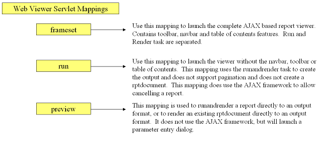
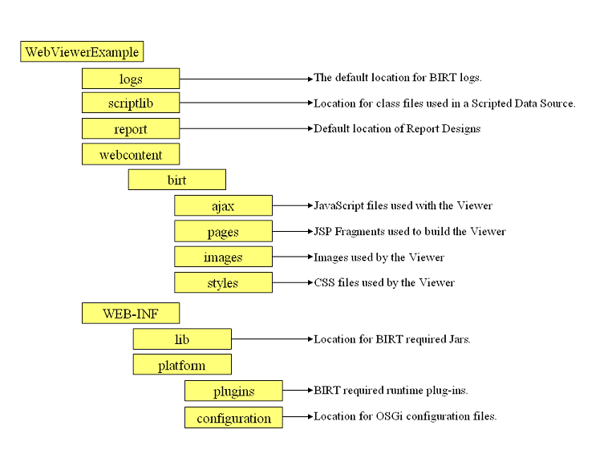
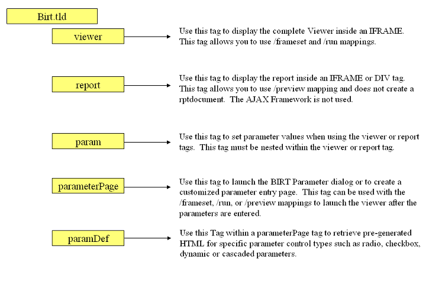

## Viewer Usage

### Overview

This Viewer is an AJAX based Java EE application that illustrates using the BIRT engine to generate and render report content.

The Web Viewer can be used to generate and render reports, and also supports more interactive features such as table of contents, exporting report content to several formats, client and server side printing, as well as report pagination. The features available will depend on what servlet mapping is used, the settings available in the web.xml file and what values are passed as parameters.

The Example Viewer can also be deployed as an Eclipse plugin in an RCP application.

The Example Viewer also ships with a tag library which can be used to provide report functionality within your existing web applications.

### Servlet Mappings

The BIRT Web Viewer consist of two main Servlets, the ViewerServlet and the BirtEngineServlet. These Servlets handle three mappings: ( /frameset, /run, and /preview).

The **/frameset** mapping renders the report in the full AJAX viewer complete with toolbar, navigation bar and table of contents features. This mapping also generates an intermediate report document from the report design file to support the AJAX based features.
eg http://localhost:8080/viewer/frameset?__report=myreport.rptdesign&parm1=value1

The **/run** mapping runs and renders the report but does not create a report document. This mapping does not supply HTML pagination, TOC or toolbar features, but does use the AJAX framework to collect parameters, support report canceling and retrieve the report output in HTML format.
eg http://localhost:8080/viewer/run?__report=myreport.rptdesign&parm1=value1

The **/preview** mapping runs and renders the report and does not generate a report document, although an existing report document can be used in which case just the render operation occurs. The output from the run and render operation is sent directly to the browser.
eg http://localhost:8080/viewer/preview?__report=myreport.rptdesign&parm1=value1

### Web Viewer Web.xml Settings

The web.xml file contains many settings used to configure the Viewer. These settings are illustrated below.

<table border="1">
  <tr>
    <td>
      
<b>Attribute</b>

    </td>
    <td>
      
<b>Description</b>

    </td>
  </tr>
  <tr>
    <td>
      
BIRT_VIEWER_LOCALE

    </td>
    <td>
      
This setting sets the default locale for the Web Viewer.

    </td>
  </tr>
  <tr>
    <td>
      
BIRT_VIEWER_WORKING_FOLDER

    </td>
    <td>
      
This is the default location for report designs. If the report design specified in a URL parameter is relative, this path is pre-pended to the report name.

    </td>
  </tr>
  <tr>
    <td>
      
BIRT_VIEWER_DOCUMENT_FOLDER

    </td>
    <td>
      
If a report document parameter (__document) is not used, this is the location that report documents will be generated in. If this setting is left blank, the default value "webapp/documents" will be used. If the__document URL parameter is used and the value is relative the report document will be created in the working folder.

    </td>
  </tr>
  <tr>
    <td>
      
WORKING_FOLDER_ACCESS_ONLY

    </td>
    <td>
      
If this value is set to true, reports will only be searched for, relative to the working folder. This prevents a user from entering a full path to a report. Relative paths below the working folder are accessible.

    </td>
  </tr>
  <tr>
    <td>
      
BIRT_VIEWER_IMAGE_DIR

    </td>
    <td>
      
Specifies the default location to store temporary images generated by the report engine. If this setting is left blank, the default location of webapp/report/images is used.

    </td>
  </tr>
  <tr>
    <td>
      
BIRT_VIEWER_LOG_DIR

    </td>
    <td>
      
Specifies the default location to store report engine log files. If this setting is left blank, the default location of webapp/logs is used.

    </td>
  </tr>
  <tr>
    <td>
      
BIRT_VIEWER_LOG_LEVEL

    </td>
    <td>
      
Sets the report engine log level. Valid values are: 
        OFF 
        SEVERE 
        WARNING 
        INFO 
        CONFIG 
        FINE 
        FINER 
        FINEST

    </td>
  </tr>
  <tr>
    <td>
      
BIRT_VIEWER_SCRIPTLIB_DIR

    </td>
    <td>
      
Specifies the default location to place Jar files used by the script engine. These can be Jars used by script engine or jars containing event handlers written in Java. These Jars are appended to the classpath. If this setting is left blank the default value of webapp/scriptlib will be used.

    </td>
  </tr>
  <tr>
    <td>
      
BIRT_RESOURCE_PATH

    </td>
    <td>
      
This setting specifies the resource path used by report engine. The resource path is used to search for libraries, images, and properties files used by a report. If this setting is left blank, resources will be searched for in the same directory as the report.

    </td>
  </tr>
  <tr>
    <td>
      
BIRT_VIEWER_MAX_ROWS

    </td>
    <td>
      
Specifies the maximum number of rows to retrieve from a dataset.

    </td>
  </tr>
  <tr>
    <td>
      
BIRT_OVERWRITE_DOCUMENT

    </td>
    <td>
      
Specifies whether to overwrite the report document every time a report is executed. The default is set to true. Valid values are true and false.

    </td>
  </tr>
  <tr>
    <td>
      
BIRT_VIEWER_CONFIG_FILE

    </td>
    <td>
      
Specifies the location of the viewer.properties file. This file contains various settings used by the viewer.

    </td>
  </tr>
  <tr>
    <td>
      
BIRT_VIEWER_PRINT_SERVERSIDE

    </td>
    <td>
      
This setting specifies whether server side printing is supported. If set to OFF the toolbar icon used for server side printing will be removed automatically. Valid values are ON and OFF.

    </td>
  </tr>
  <tr>
    <td>
      
HTML_ENABLE_AGENTSTYLE_ENGINE

    </td>
    <td>
      
This setting determines how BIRT styles are handled with the HTML emitter. If set to TRUE, the BIRT engine will output the styles directly to the report and depends on the browser to implement the style calculations. If set to FALSE the emitter will use the BIRT style engine to calculate the styles and will output the results directly to the report.

    </td>
  </tr>
</table>

### Parameters

The example viewer has a distinction between report parameters and viewer configuration parameters. Report parameters are used by the report designs and configuration parameters affect the appearance and features available to the example Viewer application. In either case these parameters can be passed as URL parameters by entering the &parmname=value syntax, passed in a html form, or passed using the jsp:parm tag. Configuration parameters by default start with two underscore characters "__" prefixed to the parameter name.

Report parameters that are designated in the design as required and are not entered in one of the above methods will cause the viewer to launch a parameter entry dialog box. Additionally the example Viewer tag library contains tags to configure and set parameters as well.

<table border="1">
  <tr>
    <td>
      
<b>Attribute</b>

    </td>
    <td>
      
<b>Description</b>

    </td>
  </tr>
  <tr>
    <td>
      
__id

    </td>
    <td>
      
A unique identifier for the viewer.

    </td>
  </tr>
  <tr>
    <td>
      
__title

    </td>
    <td>
      
Sets the report title.

    </td>
  </tr>
  <tr>
    <td>
      
__showtitle

    </td>
    <td>
      
Determines if the report title is shown in the frameset viewer. Defaults to true. Valid values are true and false.

    </td>
  </tr>
  <tr>
    <td>
      
__toolbar

    </td>
    <td>
      
Determines if the report toolbar is shown in the frameset viewer. Defaults to true. Valid values are true and false.

    </td>
  </tr>
  <tr>
    <td>
      
__navigationbar

    </td>
    <td>
      
Determines if the navigation bar is shown in the frameset viewer. Defaults to true. Valid values are true and false.

    </td>
  </tr>
  <tr>
    <td>
      
__parameterpage

    </td>
    <td>
      
Determines if the parameter page is displayed. By default the frameset, run and preview mappings will automatically determine if the parameter page is required. This setting will override this behavior. Valid values are true and false.

    </td>
  </tr>
  <tr>
    <td>
      
__report

    </td>
    <td>
      
Sets the name of the report design to process. This can be an absolute path or relative to the working folder (See web.xml settings).

    </td>
  </tr>
  <tr>
    <td>
      
__document

    </td>
    <td>
      
Sets the name for the rptdocument. The document is created when the report engine separates run and render tasks, and is used to support features like table of contents and pagination. This setting can be an absolute path or relative to the working folder (See web.xml settings). If no document parameter is used, a unique document is created in the document folder (see web.xml settings).

    </td>
  </tr>
  <tr>
    <td>
      
__format

    </td>
    <td>
      
Specifies the desired output format, such as pdf, html, doc, ppt, or xls.

    </td>
  </tr>
  <tr>
    <td>
      
__locale

    </td>
    <td>
      
Specifies the locale for the specific operation. Note that this will override the default locale. Order of precedence is as follows:

      
__locale parameter.

      
Locale from client browser.

      
Locale web.xml setting.

      
Locale for the application server.

    </td>
  </tr>
  <tr>
    <td>
      
__svg

    </td>
    <td>
      
Specifies whether SVG is supported.

    </td>
  </tr>
  <tr>
    <td>
      
__page

    </td>
    <td>
      
Specifies specific page to render.

    </td>
  </tr>
  <tr>
    <td>
      
__pagerange

    </td>
    <td>
      
Specifies page range to render. Eg 1-4,7.

    </td>
  </tr>
  <tr>
    <td>
      
__isnull

    </td>
    <td>
      
Specifies that a report parameter has a null value. Eg __isnull=Myparameter.

    </td>
  </tr>
  <tr>
    <td>
      
__islocale

    </td>
    <td>
      
Specifies whether the parameter is localized.

    </td>
  </tr>
  <tr>
    <td>
      
__masterpage

    </td>
    <td>
      
Indicates that the report master page should be used or not. Valid values are true and false.

    </td>
  </tr>
  <tr>
    <td>
      
__overwrite

    </td>
    <td>
      
This setting if set to true will force an overwrite of the existing report document. This setting will override the initial setting in the web.xml. By default the report document is overwritten anytime the report design is changed.

    </td>
  </tr>
  <tr>
    <td>
      
__bookmark

    </td>
    <td>
      
Specifies a specific bookmark within the report to load. The viewer will automatically load the appropriate page.

    </td>
  </tr>
  <tr>
    <td>
      
__rtl

    </td>
    <td>
      
Specifies whether to display the report in right to left format. This setting defaults to false.

    </td>
  </tr>
  <tr>
    <td>
      
__fittopage

    </td>
    <td>
      
Specifies whether PDF generation should fit content to a page. Valid values are true and false.

    </td>
  </tr>
  <tr>
    <td>
      
__resourceFolder

    </td>
    <td>
      
Specifies the resource folder to use. This setting will override the default setting in the web.xml. The resource folder is used to locate libraries, images, and resource files.

    </td>
  </tr>
</table>

### Viewer Directory Structure

The Example Web Viewer has the following directory structure.

### BIRT POJO Viewer:

If you are installing BIRT 3.7 or higher, The platform, configuration, and plugin directories has been removed from the Viewer. See the [BIRT 3.7 Migration Guide](http://wiki.eclipse.org/Birt_3.7_Migration_Guide) for more details.

Most of the directories are configurable using variables set within web.xml. The **WEB-INF/platform**, webcontent, and **WEB-INF/lib** directories are exceptions.

The BIRT plugins and associated OSGi configuration files are located in the **WEB-INF/platform** directory. This directory is hard coded in the Viewer, but allows the application to be deployed in WAR format. When deployed in this manner the Viewer source will create a copy of the platform directory in a directory that is set with the system variable **javax.servlet.context.tempdir**. Once the platform directory is created the BIRT plugins will be copied to the tempdir and the Platform is then started.

The webcontent directory contains the JavaScript files used for AJAX communications, the JSP fragments used to construct the Viewer instance, image files used by the Viewer, and the cascading style sheets used within the Viewer.

The **WEBINF/lib** directory contains the required Jars for the Viewer to operate.

Additional Jar files that are used by deployed reports can be placed in the **WEB-INF/lib** or the scriptlib directories. See the web.xml settings section for additional details.

### Viewer Tag Library

The Web Viewer now contains a tag library that can be used to customize the behavior of the Viewer. This tag library can be deployed by either deploying the viewer as normal or by using the BIRT Web Deployment project wizard. In addition, if you desire to have BIRT deployed in one context and include the tag library in a separate context this can be done by copying the birt.tld file to your **WEB-INF/tlds** directory and copying coreapi.jar, modelapi,jar, viewerservlets.jar, engineapi.jar, and com.ibm.icu_version.jar from the Viewer libs directory to the new context/web-inf/lib directory. Add the following reference to your web.xml

     <jsp-config>
					<taglib>
					<taglib-uri>/birt.tld</taglib-uri>
					<taglib-location>/WEB-INF/tlds/birt.tld</taglib-location>
					</taglib>
					</jsp-config>

Using this approach reports are referenced in relation to the BIRT Viewer not the new context.

The Viewer tag library contains five tags param, paramDef, parameterPage, report and viewer. Each tag has multiple attributes that control the behavior of the Viewer.

Example JSP

     <%@ page language="java" contentType="text/html; charset=ISO-8859-1"
					pageEncoding="ISO-8859-1"%>
					<%@ taglib uri="/birt.tld" prefix="birt" %>
					<!DOCTYPE html PUBLIC "-//W3C//DTD HTML 4.01 Transitional//EN"
					   "http://www.w3.org/TR/html4/loose.dtd">
					<html>
					<head>
					<meta http-equiv="Content-Type" content="text/html; charset=ISO-8859-1">
					<title>Insert title here</title>
					</head>
					<body>
					<birt:viewer id="birtViewer" reportDesign="TopNPercent.rptdesign"
					pattern="frameset"
					height="450"
					width="700"
					format="html">
					</birt:viewer>
					</body>
					</html>

### The viewer Tag Attributes

<table border="1">
<tbody>
<tr>
<td>

Attribute

</td>
<td>

Description

</td>
</tr>
<tr>
<td>

id

</td>
<td>

A unique identifier for the viewer.

</td>
</tr>
<tr>
<td>

pattern

</td>
<td>

The Viewer tag supports either run or frameset, which matches the standard viewer servlet mappings. Frameset is used by default.

</td>
</tr>
<tr>
<td>

baseURL

</td>
<td>

The baseURL is used to determine the location of the Viewer application. If the tags are used in the same context as the BIRT viewer this attribute is not required. If the tag library is used in a separate context but in the same application server, this setting may contain a value such as baseURL="/ WebViewerExample".

</td>
</tr>
<tr>
<td>

title

</td>
<td>

Sets the title for the report container page.

</td>
</tr>
<tr>
<td>

isHostPage

</td>
<td>

If this value is set to true the viewer tag will occupy the entire page. The default value is false, which allows multiple reports to be contained in one JSP Page.

</td>
</tr>
<tr>
<td>

scrolling

</td>
<td>

Sets the IFRAME scrolling style attribute. Valid values are auto, yes, and no. If isHostPage is true these values are ignored.

</td>
</tr>
<tr>
<td>

position

</td>
<td>

Sets the IFRAME position style attribute. Valid values are static, absolute, relative and fixed. If isHostPage is true these values are ignored.

</td>
</tr>
<tr>
<td>

style

</td>
<td>

Sets the style for the report container. If isHostPage is true this value is ignored.

</td>
</tr>
<tr>
<td>

height

</td>
<td>

Sets the Height of the IFRAME in pixels. If isHostPage is true this value is ignored.

</td>
</tr>
<tr>
<td>

width

</td>
<td>

Sets the Width of the IFRAME in pixels. If isHostPage is true this value is ignored.

</td>
</tr>
<tr>
<td>

top

</td>
<td>

Sets the top of the IFRAME in pixels. If isHostPage is true this value is ignored.

</td>
</tr>
<tr>
<td>

left

</td>
<td>

Sets the left of the IFRAME in pixels. If isHostPage is true this value is ignored.

</td>
</tr>
<tr>
<td>

frameborder

</td>
<td>

Specifies whether or not to display a border around the IFRAME. Valid values are yes or no. If isHostPage is true this value is ignored.

</td>
</tr>
<tr>
<td>

reportDesign

</td>
<td>

Specifies the name of the report design file. This setting can be relative or set to a full path, or a URL.

</td>
</tr>
<tr>
<td>

reportDocument

</td>
<td>

Sets the name of the report document file. This setting can be relative or set to a full path, or a URL. If using a URL it must be a file URL. File://.

</td>
</tr>
<tr>
<td>

reportletId

</td>
<td>

Specifies the instance id of the portion of the report to be displayed. Note this only works with the run pattern and a reportDocument setting.

</td>
</tr>
<tr>
<td>

bookmark

</td>
<td>

Specifies which bookmark to load within the report. For example, adding a table of contents and specifying the TOC entry will load the page containing that entry.

</td>
</tr>
<tr>
<td>

locale

</td>
<td>

Specifies the locale for the report.

</td>
</tr>
<tr>
<td>

svg

</td>
<td>

Specifies where SVG for charts is supported.

</td>
</tr>
<tr>
<td>

format

</td>
<td>

Specifies the output format, such as pdf, html, or xls.

</td>
</tr>
<tr>
<td>

rtl

</td>
<td>

Sets the right to left flag. By default this is false.

</td>
</tr>
<tr>
<td>

pageNum

</td>
<td>

Displays a specific page within the report.

</td>
</tr>
<tr>
<td>

pageRange

</td>
<td>

Displays a specific page range within the report. For example 2-5, 12.

</td>
</tr>
<tr>
<td>

resourceFolder

</td>
<td>

Specifies the resource folder, which contains libraries and images. This is usually specified in the Web.xml, but this parameter will override that value.

</td>
</tr>
<tr>
<td>

forceOverwriteDocument

</td>
<td>

Specifies whether the report document that is created is overwritten. Only valid with the frameset mapping.

</td>
</tr>
<tr>
<td>

showToolBar

</td>
<td>

When using the Viewer tag with the frameset pattern, this setting determines if the toolbar is displayed.

</td>
</tr>
<tr>
<td>

showNavigationBar

</td>
<td>

When using the Viewer tag with the frameset pattern, this setting determines if the navigation bar is displayed.

</td>
</tr>
<tr>
<td>

showTitle

</td>
<td>

When using the Viewer tag with the frameset pattern, this setting determines if the report title is displayed.

</td>
</tr>
<tr>
<td>

showParameterPage

</td>
<td>

When using the Viewer tag, this setting determines if the parameter page is displayed.

</td>
</tr>
</tbody>
</table>

### The report Tag Attributes

<table border="1">

  <tr>
    <td>
      
Attribute

    </td>
    <td>
      
Description

    </td>
  </tr>
  <tr>
    <td>
      
id

    </td>
    <td>
      
A
        unique identifier for the viewer.

    </td>
  </tr>
  <tr>
    <td>
      

        baseURL
      

    </td>
    <td>
      
The
        baseURL is used to determine the location of the
        Viewer application. If the tags are
        used in the same context as the BIRT viewer this attribute is not
        required. If the tag library is used
        in a separate context but in the same application server, this setting may
        contain a value such as baseURL="/
        WebViewerExample".
        The reportContainer attribute must be set to
        iframe if this attribute is used.

    </td>
  </tr>
  <tr>
    <td>
      

        isHostPage
      

    </td>
    <td>
      
If
        this value is set to true the viewer tag will occupy the entire page.
        The default value is false, which allows
        multiple reports to be contained in one JSP Page.

    </td>
  </tr>
  <tr>
    <td>
      
scrolling

    </td>
    <td>
      
Sets
        the DIV/IFRAME scrolling style attribute.
        Valid values are auto, yes, and no.
        If isHostPage is true these values are
        ignored.

    </td>
  </tr>
  <tr>
    <td>
      
position

    </td>
    <td>
      
Sets
        the DIV/IFRAME position style attribute.
        Valid values are static, absolute, relative and fixed.
        If isHostPage is
        true these values are ignored.

    </td>
  </tr>
  <tr>
    <td>
      
style

    </td>
    <td>
      
Sets
        the style for the report container. If isHostPage
        is true this value is ignored.

    </td>
  </tr>
  <tr>
    <td>
      
height

    </td>
    <td>
      
Sets
        the Height of the IFRAME in pixels. If isHostPage
        is true this value is ignored.

    </td>
  </tr>
  <tr>
    <td>
      
width

    </td>
    <td>
      
Sets
        the Width of the IFRAME in pixels. If isHostPage is
        true this value is ignored.

    </td>
  </tr>
  <tr>
    <td>
      
top

    </td>
    <td>
      
Sets
        the top of the IFRAME in pixels. If isHostPage is
        true this value is ignored.

    </td>
  </tr>
  <tr>
    <td>
      
left

    </td>
    <td>
      
Sets
        the left of the IFRAME in pixels. If isHostPage is
        true this value is ignored.

    </td>
  </tr>
  <tr>
    <td>
      

        frameborder
      

    </td>
    <td>
      
Specifies
        whether or not to display a border around the IFRAME.
        Valid values are yes or
        no. If isHostPage
        is true this value is ignored.
        reportContainer must be set to
        iframe.

    </td>
  </tr>
  <tr>
    <td>
      

        reportDesign
      

    </td>
    <td>
      
Specifies
        the name of the report design file.
        This setting can be relative or set to a full path, or a URL.

    </td>
  </tr>
  <tr>
    <td>
      

        reportDocument
      

    </td>
    <td>
      
Sets
        the name of the report document file.
        This setting can be relative or set to a full path, or a URL.
        If using a URL it must be a file URL.
        File://.
        Note that a report document will not be created, but if the
        reportDocument exist it will be rendered.

    </td>
  </tr>
  <tr>
    <td>
      

        reportletId
      

    </td>
    <td>
      
Specifies
        the instance id of the portion of the report to be displayed.
        Note this only works with the run pattern
        and a reportDocument setting.

    </td>
  </tr>
  <tr>
    <td>
      
bookmark

    </td>
    <td>
      
Specifies
        which bookmark to load within the report.
        For example, adding a table of contents and specifying the TOC 

      

        entry
        will load the page containing that
        entry.

    </td>
  </tr>
  <tr>
    <td>
      
locale

    </td>
    <td>
      
Specifies
        the locale for the report.

    </td>
  </tr>
  <tr>
    <td>
      

        svg
      

    </td>
    <td>
      
Specifies
        where SVG for charts is supported.

    </td>
  </tr>
  <tr>
    <td>
      
format

    </td>
    <td>
      
Specifies
        the output format, such as pdf, html, or
        xls.

    </td>
  </tr>
  <tr>
    <td>
      

        rtl
      

    </td>
    <td>
      
Sets
        the right to left flag. By default
        this is false.

    </td>
  </tr>
  <tr>
    <td>
      

        pageNum
      

    </td>
    <td>
      
Displays
        a specific page within the report.
        Report document must already exist.

    </td>
  </tr>
  <tr>
    <td>
      

        pageRange
      

    </td>
    <td>
      
Displays
        a specific page range within the report.
        For example 2-5, 12. Report
        Document must already exist.

    </td>
  </tr>
  <tr>
    <td>
      

        resourceFolder
      

    </td>
    <td>
      
Specifies
        the resource folder, which contains libraries and images.
        This is usually specified in the
        Web.xml, but this parameter will override that value.

    </td>
  </tr>
  <tr>
    <td>
      

        showParameterPage
      

    </td>
    <td>
      
When
        using the report tag, this setting determines if the parameter page is
        displayed. If reportContainer
        is set to div, this setting is ignored and the parameter page is not displayed.

    </td>
  </tr>
  <tr>
    <td>
      

        reportContainer
      

    </td>
    <td>
      
Specifies
        if the report is rendered in an IFRAME or a DIV element.
        This attribute affects other attributes.

    </td>
  </tr>
</table>

### The param Tag Attributes
<table border="1">
  <tr>
    <td>
      
Attribute

    </td>
    <td>
      
Description

    </td>
  </tr>
  <tr>
    <td>
      
id

    </td>
    <td>
      
A
        unique identifier for the viewer.

    </td>
  </tr>
  <tr>
    <td>
      
name

    </td>
    <td>
      
Specifies
        the report parameter name. This must
        match the design file.

    </td>
  </tr>
  <tr>
    <td>
      
pattern

    </td>
    <td>
      
Specifies the report parameter pattern format. If
        isLocale is false, this value is ignored.
      

    </td>
  </tr>
  <tr>
    <td>
      

        isLocale
      

    </td>
    <td>
      
Specifies
        whether the report parameter value is a locale/format related string.
        Valid values are true or false.

    </td>
  </tr>
  <tr>
    <td>
      
value

    </td>
    <td>
      
Sets
        the value for the report parameter. If
        this is left blank the default value for the parameter is used.

    </td>
  </tr>
  <tr>
    <td>
      

        displaytext
      

    </td>
    <td>
      
Set
        the display text for the parameter.

    </td>
  </tr>
</table>

### The parameterPage Tag Attributes
<table border="1">
  <tr>
    <td>
      
Attribute

    </td>
    <td>
      
Description

    </td>
  </tr>
  <tr>
    <td>
      
id

    </td>
    <td>
      
A
        unique identifier for the viewer.

    </td>
  </tr>
  <tr>
    <td>
      
name

    </td>
    <td>
      
Specifies
        the report parameter page name. This
        attribute is used to create a form and is required if using the
        isCustom attribute. This attribute must be unique.

    </td>
  </tr>
  <tr>
    <td>
      

        isCustom
      

    </td>
    <td>
      
Indicates
        whether the default BIRT parameter page is used or a custom page.
        Valid values are true and false.

    </td>
  </tr>
  <tr>
    <td>
      
pattern

    </td>
    <td>
      
The
        parameterPage tag supports run, frameset, and
        preview mappings. Frameset is used by
        default.

    </td>
  </tr>
  <tr>
    <td>
      

        baseURL
      

    </td>
    <td>
      
The
        baseURL is used to determine the location of the
        Viewer application. If the tags are
        used in the same context as the BIRT viewer this attribute is not
        required. If the tag library is used
        in a separate context but in the same application server, this setting may
        contain a value such as baseURL="/
        WebViewerExample".

    </td>
  </tr>
  <tr>
    <td>
      
target

    </td>
    <td>
      
Specifies
        the target window for the form submit.
        For example: _blank or parent

    </td>
  </tr>
  <tr>
    <td>
      
title

    </td>
    <td>
      
Sets
        the title for the report container page.

    </td>
  </tr>
  <tr>
    <td>
      
scrolling

    </td>
    <td>
      
Sets
        the IFRAME scrolling style attribute.
        Valid values are auto, yes, and no

    </td>
  </tr>
  <tr>
    <td>
      
position

    </td>
    <td>
      
Sets
        the IFRAME position style attribute.
        Valid values are static, absolute, relative and fixed.
      

    </td>
  </tr>
  <tr>
    <td>
      
style

    </td>
    <td>
      
Sets
        the style for the report container

    </td>
  </tr>
  <tr>
    <td>
      
height

    </td>
    <td>
      
Sets
        the Height of the IFRAME in pixels. 

    </td>
  </tr>
  <tr>
    <td>
      
width

    </td>
    <td>
      
Sets
        the Width of the IFRAME in pixels. 

    </td>
  </tr>
  <tr>
    <td>
      
top

    </td>
    <td>
      
Sets
        the top of the IFRAME in pixels. 

    </td>
  </tr>
  <tr>
    <td>
      
left

    </td>
    <td>
      
Sets
        the left of the IFRAME in pixels. 

    </td>
  </tr>
  <tr>
    <td>
      

        frameborder
      

    </td>
    <td>
      
Specifies
        whether or not to display a border around the IFRAME.
        Valid values are yes or
        no. If isCustom
        is true this value is ignored.

    </td>
  </tr>
  <tr>
    <td>
      

        reportDesign
      

    </td>
    <td>
      
Specifies
        the name of the report design file.
        This setting can be relative or set to a full path, or a URL.

    </td>
  </tr>
  <tr>
    <td>
      

        reportDocument
      

    </td>
    <td>
      
Sets
        the name of the report document file.
        This setting can be relative or set to a full path, or a URL.
        If using a URL it must be a file URL.
        File://. 

    </td>
  </tr>
  <tr>
    <td>
      

        reportletId
      

    </td>
    <td>
      
Specifies
        the instance id of the portion of the report to be displayed.
        Note this only works with the run pattern
        and a reportDocument setting.

    </td>
  </tr>
  <tr>
    <td>
      
bookmark

    </td>
    <td>
      
Specifies
        which bookmark to load within the report.
        For example, adding a table of contents and specifying the TOC 

      

        entry
        will load the page containing that
        entry.

    </td>
  </tr>
  <tr>
    <td>
      
locale

    </td>
    <td>
      
Specifies
        the locale for the report.

    </td>
  </tr>
  <tr>
    <td>
      

        svg
      

    </td>
    <td>
      
Specifies
        where SVG for charts is supported.

    </td>
  </tr>
  <tr>
    <td>
      
format

    </td>
    <td>
      
Specifies
        the output format, such as pdf, html, or
        xls.

    </td>
  </tr>
  <tr>
    <td>
      

        rtl
      

    </td>
    <td>
      
Sets
        the right to left flag. By default
        this is false.

    </td>
  </tr>
  <tr>
    <td>
      

        resourceFolder
      

    </td>
    <td>
      
Specifies
        the resource folder, which contains libraries and images.
        This is usually specified in the
        Web.xml, but this parameter will override that value.

    </td>
  </tr>
  <tr>
    <td>
      

        forceOverwriteDocument
      

    </td>
    <td>
      
Specifies
        whether the report document that is created is overwritten.
        Only valid with the frameset mapping.

    </td>
  </tr>
  <tr>
    <td>
      

        showToolBar
      

    </td>
    <td>
      
When
        using the Viewer tag with the frameset pattern, this setting determines if
        the toolbar is displayed.

    </td>
  </tr>
  <tr>
    <td>
      

        showNavigationBar
      

    </td>
    <td>
      
When
        using the Viewer tag with the frameset pattern, this setting determines if
        the navigation bar is displayed.

    </td>
  </tr>
  <tr>
    <td>
      

        showTitle
      

    </td>
    <td>
      
When
        using the Viewer tag with the frameset pattern, this setting determines if
        the report title is displayed.

    </td>
  </tr>
</table>

<h3>The paramDef Tag Attributes</h3>

<table border="1">
  <tr>
    <td>
      
id

    </td>
    <td>
      
A
        unique identifier for the parameter control.

    </td>
  </tr>
  <tr>
    <td>
      
name

    </td>
    <td>
      
Specifies
        the report parameter name. This must
        match the parameter name in the report.

    </td>
  </tr>
  <tr>
    <td>
      

        isCustom
      

    </td>
    <td>
      
Indicates
        whether the default BIRT parameter page is used or a custom page.
        Valid values are true and false.

    </td>
  </tr>
  <tr>
    <td>
      
pattern

    </td>
    <td>
      
Specifies the report parameter pattern format. If
        isLocale is false, this value is ignored.
      

    </td>
  </tr>
  <tr>
    <td>
      
value

    </td>
    <td>
      
Sets
        the value for the report parameter. If
        this is left blank the default value for the parameter is used.

    </td>
  </tr>
  <tr>
    <td>
      

        displaytext
      

    </td>
    <td>
      
Set
        the display text for the parameter.

    </td>
  </tr>
  <tr>
    <td>
      

        isLocale
      

    </td>
    <td>
      
Specifies
        whether the report parameter value is a locale/format related string.
        Valid values are true or false.

    </td>
  </tr>
  <tr>
    <td>
      
title

    </td>
    <td>
      
Specifies
        the title attribute of the parameter control.

    </td>
  </tr>
  <tr>
    <td>
      

        cssClass
      

    </td>
    <td>
      
Sets
        the CSS class attribute of the parameter control.

    </td>
  </tr>
  <tr>
    <td>
      
style

    </td>
    <td>
      
Specifies
        the style for the parameter control.

    </td>
  </tr>
</table>
